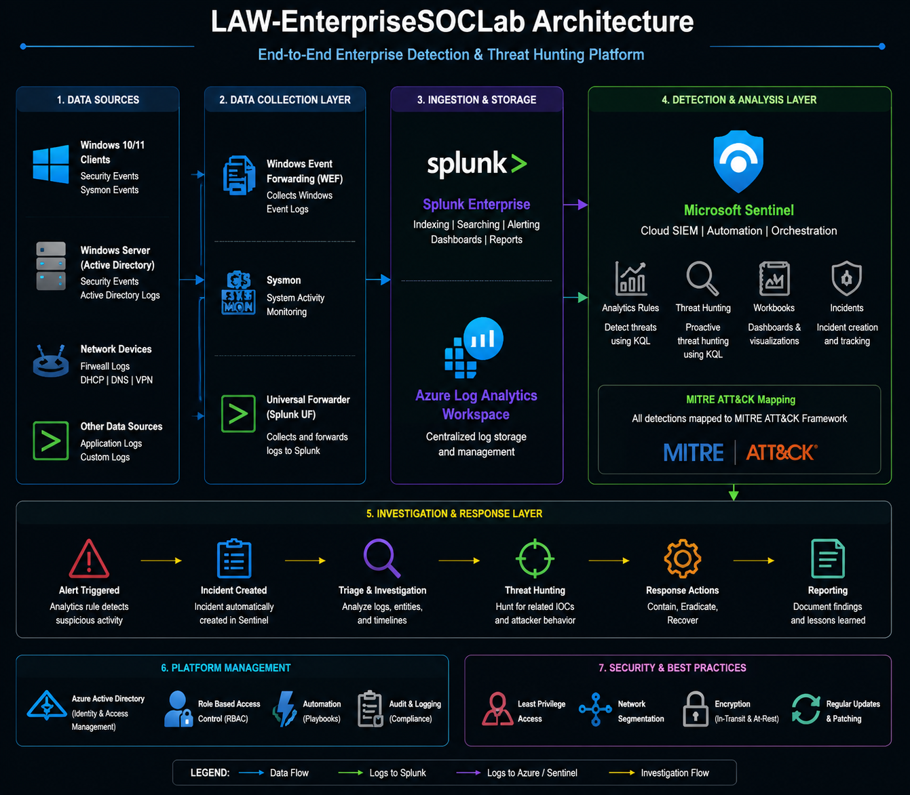

# LAW-EnterpriseSOCLab

Enterprise Security Operations Center (SOC) laboratory demonstrating enterprise-scale security monitoring, detection engineering, threat hunting, and incident investigation using Microsoft Sentinel, Splunk Enterprise, Active Directory, Sysmon, and Windows Security telemetry.

---

## Overview

LAW-EnterpriseSOCLab is a hands-on enterprise SOC laboratory designed to simulate modern Security Operations Center workflows within a controlled environment. The project focuses on collecting, monitoring, analyzing, and investigating Windows security events to develop practical detection engineering and threat hunting capabilities.

The environment integrates Microsoft Sentinel, Splunk Enterprise, Windows Server Active Directory, Sysmon, and Windows Event Logs to centralize security telemetry and validate detection use cases aligned with real-world blue team operations.

---

## Key Features

- Enterprise Windows Security Monitoring
- Active Directory Security Monitoring
- Microsoft Sentinel & Splunk Integration
- Sysmon Telemetry Collection
- Windows Security Event Analysis
- Detection Engineering using KQL & SPL
- Threat Hunting Workflows
- Incident Investigation
- Security Dashboard Development
- MITRE ATT&CK Mapping

---

## Technology Stack

| Category | Technologies |
|-----------|--------------|
| SIEM | Microsoft Sentinel, Splunk Enterprise |
| Identity | Active Directory Domain Services (AD DS) |
| Operating Systems | Windows Server 2022, Windows 11 |
| Log Sources | Windows Security Events, Sysmon |
| Query Languages | KQL, SPL |
| Framework | MITRE ATT&CK |
| Virtualization | Oracle VirtualBox |

---

## Lab Architecture

The lab simulates an enterprise Windows environment where security telemetry generated by endpoints and Active Directory is centralized within SIEM platforms for monitoring, detection engineering, threat hunting, and incident investigation.

### Components

- Windows Server 2022 (Domain Controller)
- Windows 11 Client
- Active Directory Domain Services
- Sysmon
- Windows Security Events
- Splunk Enterprise
- Microsoft Sentinel
- Azure Log Analytics Workspace

> **Architecture Diagram**

<p align="center">

</p>

---

## Repository Structure

```text
LAW-EnterpriseSOCLab
│
├── assets/
├── detections/
├── diagrams/
├── docs/
├── hunting/
├── queries/
├── reports/
├── screenshots/
├── CHANGELOG.md
├── CONTRIBUTING.md
├── SECURITY.md
└── README.md
```

---

## Documentation

Detailed technical documentation is available within the `docs/` directory.

- Architecture
- Lab Deployment
- Detection Engineering
- Threat Hunting
- Incident Investigation
- MITRE ATT&CK Mapping
- Validation & Testing

---

## Skills Demonstrated

- Security Operations Center (SOC)
- Detection Engineering
- Threat Hunting
- Windows Security Monitoring
- Active Directory Security
- Microsoft Sentinel
- Splunk Enterprise
- Kusto Query Language (KQL)
- Splunk Processing Language (SPL)
- Windows Event Analysis
- Sysmon Analysis
- MITRE ATT&CK Framework
- Incident Investigation

---

## Screenshots

Representative screenshots of dashboards, detections, investigations, and threat hunting activities are available in the `screenshots/` directory.

---

## Disclaimer

This project was developed for educational and research purposes within an isolated laboratory environment. All attack simulations, detections, and investigations were performed exclusively in a controlled environment.

---

## Author

**Danish Mansuri**

Cyber Security | SOC Analyst | Detection Engineering | Threat Hunting
